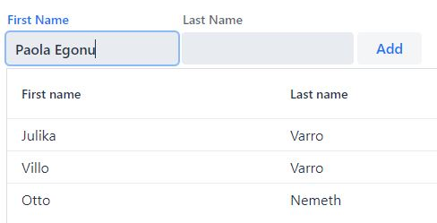

# cristina10
A multi-project repo for TypeScript web server, front-end and database applications (Chirichella)

## tslitstrap

On-line sample on Azure [white-pond](https://white-pond-01b194d03.azurestaticapps.net/)

*Bootstrap* could be used easily via CDN, but TypeScript and Lit are not so it's better to create a *Vite* or *WebPack* project. Then the next major question is Shadow DOM or Light DOM web components you want to use?

The extreme complexity of styling Shadow DOM s because of its strict encapsulation is a major hindrance of web components becoming more popular.
- Fortunately Custom Elements can be defined with Light DOM, too,
[Bootstrap Web Components #28131](https://github.com/twbs/bootstrap/issues/28131) is nice discussion with examples how Bootstrap could be used with light DOM custom elements.
- In this discussion [blikblum's example](https://github.com/twbs/bootstrap/issues/28131#issuecomment-586651225) shows what can be achieved.
  - Here is [another interesting discussion](https://github.com/WICG/webcomponents/issues/909) about how shadow DOM could be made more programmer's friendly.
- In [using-bootstrap-in-web-components-shadowdom](https://stackoverflow.com/questions/66234047/using-bootstrap-in-web-components-shadowdom) If you don't use shadow DOM, you don't need these at all.
  ```ts
  import bootstrap from './path/to/bootstrap.css';
  class MyElement extends LitElement {
    static styles = bootstrap; // If your build system already converted
                              // the stylesheet to a CSSResult
    static styles = unsafeCss(bootstrap); // If bootstrap is plain text
  }
  ```
  - This guy explains that rollutup an even webpack has tools to convert CSS to CSSResult.
  [rollup-plugin-postcss-lit](https://www.npmjs.com/package/rollup-plugin-postcss-lit) This plugin is pre-configured to work with Vite, just add it to plugins and your styles will be Lit-ified
  `npm i -D rollup-plugin-postcss-lit`
  ```js
  import {LitElement, css} from 'lit'
  import {customElement} from 'lit/decorators.js'
  import myStyles from './styles.css'
  import otherStyles from './other-styles.scss'
  @customElement('my-component')
  export class MyComponent extends LitElement {
    // Add a single style
    static styles = myStyles;
    // Or more!
    static styles = [myStyles, otherStyles, css`
      .foo {
        color: ${...};
      }
    `];
    render() {
      // ...
    }
  }

  // vite.config.js/ts
  import postcssLit from 'rollup-plugin-postcss-lit';
  export default {
    plugins: [
      postcssLit(),
    ],
  };
  //And here are the options:
  postcssLit({
    // A glob (or array of globs) of files to include.
    // Default: **/*.{css,sss,pcss,styl,stylus,sass,scss,less}
    include: ...,
    // A glob (or array of globs) of files to exclude.
    // Default: null
    exclude: ...,
    // A string denoting the name of the package from which to import the `css`
    // template tag function. For lit-element this can be changed to 'lit-element'
    // Default: 'lit'
    importPackage: ...,
  }),
  ```
  At the end of the documentation of this plugin it says that "This plugin is meant to be used with *rollup-plugin-postcss*. If you only need to load plain css files in your LitElement components, consider using *rollup-plugin-lit-css*"
  - And this is the rollup plugin suggested above [rollup-plugin-lit-css](https://www.npmjs.com/package/rollup-plugin-lit-css)
  ```ts
  /* css-in-css.css */
  :host {
    display: block;
  }
  h1 {
    color: hotpink;
  }

  import { LitElement, customElement, html } from 'lit-element';
  import style from './css-in-css.css';
  @customElement('css-in-css')
  class CSSInCSS extends LitElement {
    static get styles() {
      return [style];
    }
    render() {
      return html`<h1>It's Lit!</h1>`;
    }
  }

  import config from './rollup.config.rest.js'
  import litcss from 'rollup-plugin-lit-css';
  export default {
    ...config,
    plugins: [
      litcss({ include, exclude, uglify })
    ]
  }
  ```
  - The same guy made a WebPack loader, too: [lit-css-loader](https://github.com/bennypowers/lit-css/tree/main/packages/lit-css-loader)
- The [Bootstrap starter template](https://github.com/twbs/bootstrap-npm-starter) on GitHub uses Bootstrap V4 and is configured with its own build toolset.
- Installing Bootstrap and Lit:
  - **npm i bootstrap bootstrap-icons @popperjs/core lit mobx @adobe/lit-mobx**
  - **npm i -D @types/bootstrap rollup-plugin-lit-css eslint**
  - **import bootstrap from "bootstrap"** is when you want to use toast, see the ksenia25 videos
  - I have already experimented with Bootstrap in [ksenia25](https://github.com/nemethmik/ksenia25) where I was experimenting with WebPack5 and I recorded a number of accompanying videos.
- The Bootrap documentation describing webpack setup explains that [you may use Bootstrap’s ready-to-use CSS by simply adding this line to your project’s entry point](https://getbootstrap.com/docs/5.0/getting-started/webpack/#importing-compiled-css) **import "bootstrap/dist/css/bootstrap.min.css"**
- [npm i @lit-labs/task](https://github.com/lit/lit/blob/main/packages/labs/task/src/task.ts) is really light-weight task controller for executing long running async calls. It shows similarities React's useEffect. 

## jobwatch
Online version is available on [Azure](https://white-beach-0d4819403.azurestaticapps.net/)

Based on the JQuery Mobile implementation's design here is a more modern Lit/Vaadin/Vite/TS version.
Project setup:
- In the repo root folder `npm init vite` then select *vanilla-ts*, then cd into *jobwatch*
- `npm install` in the jobwatch project folder to install dev dependencies
  - Remember to change *target* to ES2021 and comment out useDefineForClassFields in tsconfig, otherwise *Lit* will not work.
- `npm install lit`
- Check out *package.json* to see which Vaadin packages to install.
- Using Vaadin's [app Layout](https://vaadin.com/docs/latest/ds/components/app-layout) was a dead-end
  - I spent a hell lot of time on the Vaadin layouts including Lumo CSS Frameweork - [see my frustration video here](https://youtu.be/by8DA3Ox_Yw) - as demonstrated in the video [Vaadin Fusion CSS Layouts (DON'T WATCH WASTE OF TIME)](https://youtu.be/bkvZyMVRVLQ) since "Vaadin 21 and later include the CSS class names out of the box, so no need to install them separately anymore". 
  So, it worked in the vaadin generated applications as expected, but I wasn't able to make it working in a "standalone" application.
  - I did't give up, I learned raw flexbox, and flexbox CSS directives worked fine with the Vaadin web components. 
  So, I dropped all Vaadin layouting components, and implemented my own plain flexbox layout. I wanted a layout with an app bar, an optionally scrollable middle contents section and a sticky bottom button bar.
    - Actually, I could live without the sticky bottom button bar, but in a handheld mobile device in the right hand, the most convenient place for buttons are on the bottom. 
  - So, I found [Create a mobile app layout with Flexbox](https://youtu.be/TrsrNZo0pOY) and https://github.com/wesbos/What-The-Flexbox/tree/master/flexbox-app-layout
  and based on that, I have elaborated a more-or-less fine solution with significant changes and code cleaning. 
    - I used semantic HTML5 element names (section (for the concept of page), header, footer, main (for middle contents area)) consistently.
    - The footer had to be removed from the section flex container to make it a zero-bottom-positioned element: `footer{position:fix; bottom:0;}`
    - I created a PageBase class derived from Lit element and that class implements the layouting CSS, and all my page components are derived from this class.
- The next challenge is to enable **dark mode**. I followed the instructions [Dark Mode](https://vaadin.com/docs/latest/ds/foundation/color/#dark-mode) but it doesn't swith to dark theme. 
- The [menu bar component](https://vaadin.com/docs/latest/ds/components/menu-bar) is a quite simplistic, but it might be OK for the job.

Here is an accompanying (unlisted) video explaining this iteration of the work on Jobwatch [Lit 2.0 Announced, Flexbox Layout for Jobwatch (Review)](https://youtu.be/U8a2DDUFnm4)

### Defining Custom Evemt Names and Payload Structures
I first tried this technique in [paola18](https://github.com/nemethmik/paola18/blob/master/src/my-ui5demo.ts) based on an article
[Sunny Sun: How to Share Constants in Typescript Project - Avoid the magic strings, make your app maintainable and strongly typed](https://medium.com/codex/how-to-share-constants-in-typescript-project-8f76a2e40352)
```ts 
export const TCustomEvents = {ConfigDone: "configdone", LoginBack: "loginback"} as const
export type TConfigDonePayload = {detail:{saved:boolean},composed: true}
```
Thi is how to dispatch properly a custom event:
```ts
    const payload:TConfigDonePayload = {detail:{saved:false},composed:true}
    this.dispatchEvent(new CustomEvent(TCustomEvents.ConfigDone,payload))
```
It is terribly important to set the **composed** option to true in custom events, otherwise it doesn't bubbles up to the application component. 
In the type definition I simply defined the type for composed as boolean false; this is a brutally fancy feature of TypeScript; **that's why we love it**.

### Event Listeners on the Application Component
If the events are dispatched with composed set to true, then the application web component can listen to all events:
```ts
  override connectedCallback():void {
    super.connectedCallback()
    // WARNING!!! DON'T DEFINE an EVENT LISTENER on THE SHADOW ROOT if you want to reference "THIS"
    // this.shadowRoot!.addEventListener( DON'T DO THIS )
    this.addEventListener(TCustomEvents.ConfigDone,this.onConfigDone as EventListener)
  }
```
Don't define the event listener on the shadow root, since then the **this** value is set to the shadow root object and not the actual component's.
Note the tricky casting `this.onConfigDone as EventListener` to prevent TypeScript complaining: 
[How to add a custom event listener?](https://github.com/microsoft/TypeScript/issues/28357#issuecomment-436484705)
 ```ts
 buttonEl.addEventListener('myCustomEvent', ((event: CustomEvent) => {
  //do something
}) as EventListener);
 ```

## vaadings (Getting Started with Vaadin)


[Vaadin Fusion](https://vaadin.com/docs/latest/fusion/overview) was implemented with JavaScript on top of LitElement, but it comes with full TzpeScript tzpe definitions, too.
[How to use Web Components, 2018 Dec 12](https://vaadin.com/learn/tutorials/using-web-components) and accompanying videos are to be followed first:
- [How to use Web Components in a JavaScript project](https://youtu.be/88Sa-SlHRxk) 

Since the project is using package libraries, a bundler is required; so, I decided to use ViteJS, since it has a template for Lit projects, exactly as I did in my [elena14](https://github.com/nemethmik/elena14), but this Vite lit-element template is to make library projects for web components, and not applications. For deployable regular web applications use the **vanilla-ts** template.
Project setup is then
- Run **npm init vite** on the repo root folder to craete *vaadings* subfolder
  - cd vaadings and npm install
- Copy *.eslintrc.json* from the other project
  - npm i -D @typescript-eslint/eslint-plugin @typescript-eslint/parser eslint
- **npm install @vaadin/vaadin-button @vaadin/vaadin-grid @vaadin/vaadin-text-field** for the example app as suggested in [How to use Web Components in a JavaScript project](https://youtu.be/88Sa-SlHRxk)

So this project is just a regular TypeScript project not using Lit Element.

## tswebcomp
After the *tsorchids* remake, I started experimenting with web components foloowing [JH Web Components Custom Elements, Templates and the Shadow DOM, 2019](https://youtu.be/_Tr9ZcXcMjQ) and the subsequent two parts.

Here is my eloquent explanation video [Web Component (Custom Element) Fundamentals with TypeScript](https://youtu.be/RjpoiFdEBWs).

I kept the *tsorchids* project, and I created a new folder *tswebcomp*. This project had only *src/index.ts* and *dist/index.html* 
I copied the files package.json (changed the project name and description), .eslintrc, tsconfig.json and .gitignore. 
I changed *.gitignore*, not to exclude the entire *dist* folder, just ignore `dist/*.js`

After cloning, the steps are exactly the same as in *tsorchids* project, but the project root folder is *tswebcomp*, of course.

For the full explanation of the videos, first watch JHerr's then mine.
Here are the main points when working with web components:
- What is the difference between an open and closed shadow root? Here is a nice explanation [open-vs-closed-shadow-dom](https://blog.revillweb.com/open-vs-closed-shadow-dom-9f3d7427d1af)
  - The short answer is that with close shadow root, you should use the object returned by the *attachShadow* function and use that for building the shadow DOM.
- *Slots* work only in the shadow DOM.
- You can build custom elements (aka web components) with Bootstrap, too, without using the shadow DOM, but then **you will not have slots** and all the styling is cascading through the components in the elements defined in the innerHTML of the custom element.
  - To demonstrate that slots are available only in the shadow DOM I have added an attribute to my-product custom element. When shadow is no defined or its value is false, then the slot-replacement machinery is lost when instantiating a custom element:
  ```html
    <my-product name="Note8" style="font-size: xx-large;" shadow>
        <span slot="price">$560</span>
        <h2>One of the best smartphones ever.</h2>
    </my-product> 
  ``` 
  This is a major limitation, and (almost) a (total) show stopper for using custom elements with lith DOM building librraies based on Bootstrap.
- You cannot use *input* elements from the shadow DOM in combination with an outside *form*.
  - You have to add *fordata* event listener and then : (for more details see [formdata-event example](https://glitch.com/edit/#!/formdata-event?path=custom-input.js%3A5%3A3))
  Apple browsers don't support fordata events. Fortnately Apple is not relevant for business applications, and Chrome is available on all Apple platforms.
    ```JavaScript
    handleFormData({formData}) {
      // add our name and value to the form's submission data if we're not disabled
      if (!this.input.disabled) {
        // https://developer.mozilla.org/en-US/docs/Web/API/FormData
        formData.append(this.input.name, this.input.value);
      }
    }    
    // find the <form>, and attach the `formdata` listener
    connectedCallback() {
      this._form = this.findContainingForm();
      if (this._form) {
        this._form.addEventListener('formdata', this._handleFormData);
      }
    }
    // remove the `formdata` listener if we're removed
    disconnectedCallback() {
      if (this._form) {
        this._form.removeEventListener('formdata', this._handleFormData);
        this._form = null;
      }
    }
    ```
- All methods defined in the class (render, show, hide in our example) is fully accessible to the users from the web page.
- If your *attributeChangedCallback* is not fired, possibly you have forgotten to define the static *observedAttributes*
- Attributes are standard feature of every HTML element, and they can be accessed with *getAttribute* and *setAttribute*, but the browser will not generate any getter/setter for them automatically; this is your job to define getter/setter properties. You can have properties without attributes, and you can have attributes without properties, and you can link them as demonstrated in this example.
- Using the standard *template* element gives the possibility that the user can define and customize the template on the HTML page without interferring the layout, since the browser doesn't render at all a template; a template is meant tor the web component developers to be rendered with JavaScript.
See [Using_templates_and_slots](https://developer.mozilla.org/en-US/docs/Web/Web_Components/Using_templates_and_slots) 
A major limitation is that a template has no machinery to generate parts dynamically. You can use regular JavaScript template literals with the placeholder expressions to create the inner text of templates, but gives no HTML diffing virtual dom feature, unlike the brilliant lit-html.  
  - Slots work without templates, too. But, cloning a template is a lot faster than rendering a HTML string for hungreds of elements in a scrolling list for example.
- Event handler functions that are defined with the classic *method* way have to be bounded when added to an event listener. Event handlers defined with *lamda* syntax are automatically bounded to the *this* keyword of the class.
  - If your event handler doesn't fire, check the handler function definition syntax and binding.
- There is no such a thing as render callback function. 
- Here are the (lifecycle) callbacks:
  - constructor [Lifecycle Callbacks](https://levelup.gitconnected.com/creating-web-components-lifecycle-callbacks-5b6ffa48a8d5) suggest not to do any rendering and data fetching in the constructor it should be done in the *connectedCallback*
  - connectedCallback
  - disconnectedCallback
  - attributeChangedCallback
- As for *HTMLElementTagNameMap* see [typescriptlang/dom-manipulation](https://www.typescriptlang.org/docs/handbook/dom-manipulation.html) 
When a lit-element project is created with Vite (see my elena14/elana14lit branch), a declaration section is generated at the bottom of the web component class TS file. 
  ```TypeScript
  declare global {
      interface HTMLElementTagNameMap {
        "my-product": MyProduct
      }
  }
  ```
- Instead of regular events, dispatch [CustomEvent](https://developer.mozilla.org/en-US/docs/Web/API/CustomEvent) and you can add data in the constructor
  ```JS
        const productDetails:TProductDetails = {name:this.name, price:854.5}
        this.dispatchEvent(new CustomEvent("buy",{detail:productDetails}))  
        //And the user can listen to that event like so:
        myProduct().addEventListener("buy",(e)=>alert('Buy Me, Please!' + JSON.stringify(e.detail)))
  ```
- [Actually](https://youtu.be/P63MsyjvPac), in practice when you create a custom element you don't have to render your template in the shadow DOM, you can implement it in the light DOM in *innerText* and you will have the regular global CSS space, which is excellent when you want to use Bootstrap with custom elements.
BUT, there is an (almost (total)) show-stopper: slots don't work in light DOM, only in shadow DOM; that is, you cannot do something like `<my-product name="Note 8"><h1 slot=price>999<h1><p>Great product</p></my-product>` 
Instead, you are forced to apply a workaround (render-props) `<my-product name="Note 8" price="<h1 slot=price>999<h1>" default="<p>Great product</p>"></my-product>` This would work excellently with a tool like *Lit* but far from elegant. It was a crazy opinionated decision from the specification designers not to enable slots for the light DOM either.
- I have implemented a way to clone automatically a *style* element in the shadow DOM
This style (global) element is applied to the entire HTML page (the light DOM) but it has an ID, too:  
```html
    <style id="my-product-style">
        h2{color:blue;}
        button{color:red;}
    </style>
```
Therefore, the MyProduct custom element class can append it to its own shadow DOM:
```ts
    get name():string {return this.getAttribute("name")!}
    connectedCallback():void {
        let template = document.getElementById("my-product-template") as HTMLTemplateElement
        if(!template) {
            template = document.createElement("template")
            template.innerHTML = /*html*/`
                <!-- Add default template -->
            ` 
        }        
        const myProductStyles = document.getElementById("my-product-style")
        if(myProductStyles) this.root.appendChild(myProductStyles.cloneNode(true))
        this.root.appendChild(template.content.cloneNode(true))
        this.root.querySelector("button")?.addEventListener("click",this.buyMeButtonClick)
        this.render()
    }
    render():void { // Not a callback, this is just my function
        const h2 = this.root.querySelector("h2")
        //The first h2 element's text will be replaced with the product name
        if(h2) h2.innerText = this.name
    }
```

## tsorchids
This is a remake of [Jack Herrington Javascript Modules in detail - Part 1](https://youtu.be/mMB8DNLotDs)

After cloning, 
- *cd tsorchids* this is the project home/root folder
- *npm install* to install the npm packages based on package.json
- *npm start* to start tsc --watch to compile-watch the TypeScript sources into the dist folder. 
- in another terminal window *npm run s4000* to start servor upon dist/index.html, or you can use Live Server, too.

Here is my quite lengthy explanation of almost every line 
[No-framework, no-bundler TypeScript WebApplication Development 01 JH's Orchids Sample Remake](https://youtu.be/9lM5e983mnQ).

The basic idea is to use only **tsc** for building the application.
Here are the steps how to initialize the project. See my other projcet [alessia8](https://github.com/nemethmik/alessia8) how to configure ESLint for TypeScript
- npm init
- npm i -D typescript eslint
- npx tsc --init
    - "target": "ESNext", 
    - "module": "ESNext",
    - "rootDir": "./src",
    - "outDir": "./dist", 
    - "inlineSourceMap": true,
    - **"strictFunctionTypes": true,** is terribly important, never leave it disabled.
- npx eslint --init
    - How would you like to use ESLint? · problems    
    - What type of modules does your project use? · esm
    - Which framework does your project use? · none
    - Does your project use TypeScript? · No / Yes
    - Where does your code run? · browser
    - What format do you want your config file to be in? · JSON
    - The config that you've selected requires the following dependencies:    
        - @typescript-eslint/eslint-plugin@latest @typescript-eslint/parser@latest
        - Would you like to install them now with npm? · No / Yes
- Add these TypeScript rules to .eslintrc:
    ```
    "@typescript-eslint/no-non-null-assertion":"off",
    "@typescript-eslint/explicit-function-return-type": "error", 
    "@typescript-eslint/explicit-module-boundary-types": ["warn", {"allowArgumentsExplicitlyTypedAsAny":true}], 
    "@typescript-eslint/no-explicit-any":"warn", 
    "quotes": ["error","double",{ "allowTemplateLiterals": true}], 
    "@typescript-eslint/semi": ["error", "never"], 
    "@typescript-eslint/ban-ts-comment": ["warn"]
    ```
- I applied **npx eslint src --fix** to fix the fixable issues on the source files I copied from [JHerr's repo](https://github.com/jherr/orchids-esm-part-1).

## Closures in JavaScript/TypeScript

The original implementation by JH was based on closures.
Here all the local variables count, subscribers, orchids and image were referenced in the functions defined for the IStore object, all of these variables are actually created on the heap and they are kept alive with reference counting.  
The *store* (global) object is created at the end of the module `export const store = createStore()`, so the local variables referenced by these functions are kept forever. 
The function *createStore* with its local variables behaves like an object constructor.
See [emulating_private_methods_with_closures](https://developer.mozilla.org/en-US/docs/Web/JavaScript/Closures#emulating_private_methods_with_closures)
```TypeScript
const createStore = ():IStore => {
  let count = 0
  const subscribers: Array<TStoreEventHandler> = []
  const orchids = [1,2,3,4,5,6,7].map(i => `orchids/orchid${i}.jpg`)
  let image = orchids[0]
  return {
    getCount: ():number => count,
    getImage: ():string => image,
    incrementCount: ():void => {
      count += 1
      subscribers.forEach(s => s("CountIncremented"))
    },
    setImage: (img:string):void => {
      image = img
      subscribers.forEach(s => s("ImageSet"))
    },
    subscribe: (fn:TStoreEventHandler):void => {
      subscribers.push(fn)
    },
    orchids,
  }
}
export const store = createStore()
```
When event listener functions are created they are kept alive until the object to which they are registered is live.
So, the *createBuytools* for example has two event listener functions and both of them references the store object that the function is received as incoming parameter.
These anonymous functions are linked to the *button (addEventListener)* object and the *store (subscribe)* object.
Since these functions reference the *store* object it is a closure again. The store object could have been a local variable, too, in this regard it doesn't matter.
```TypeScript
export const createBuytools = (el:HTMLElement,store:IStore):void => {
    ...
    document.getElementById(ADDTOCART)!.addEventListener("click", () => {
        store.incrementCount()
    }); 
    store.subscribe((ev:TStoreEventType) => {
        if(ev == "ImageSet") (document.getElementById(ORCHIDIMAGE)! as HTMLImageElement).src = store.getImage()
    })
}
``` 
## Loading Modules Dinamically Implementing a Micro FrontEnd (Micro-FE) Architecture
This second part is based on [JH: Javascript Modules in detail - Part 2](https://www.youtube.com/watch?v=d7SL7dckSf0).
[Servor](https://www.npmjs.com/package/servor) is used to mimic the multiple miro-FE provider concept running on different ports.
Servor has hot reload as well as built in CORS enabled without any configuration, which is very important for testing multi-site/multi-server applications. 
- Make sure to navigate to the home folder (tsorchid) of the project (not the root folder of the mult-project repo)
- **npx servor dist index.html 4000 --browse --reload** starts *servor* on the *dist* folder opening *index.html* on port *4000* opening a browser and reloading when any file is changed. 
- I added a script command to *package.json*, too `"s4000":"npx servor dist index.html 4000 --browse --reload"` using **npm run s4000**

Eventually, I lost interest since this kind of JavaScript source module distribution (federation) might primarily be interesting for wbesite, portal builders. Business applications are communicationg via API's and for single signon with HTTP redirections. On the other hand, having a business app, production data collection, warehousing mobile scanner, and the application manufacturer could implement data validations, user interface composition with this dynamic JavaScript module loading. Yep, definitely thhis would be very important for a major out-of-the-box standard project. 
The configuration details should have been stored in a separate JavaScript module, which is not part of the standard application deplyment, so every time a new version is delivered, the configuration JavaScript module would be kept as is.
In a cloud service scenario each tenant could have its configuration data table with the urls for the custom modules; but, in this scenario allowing a customer to inject its own custom JavaScript code would be a major risk; so this would work best in a customer-dedicated deployment, where the standard application would be deployed on the customers server or virtual machine in a cloud.
So, this [github.com/jherr/orchids-esm-part-2](https://github.com/jherr/orchids-esm-part-2) could be vey useful in case I decided to start a major
project with Miro-FE.

In the index.html he used `<component src="http://localhost:4002/header.js"></component>` and
`<component src="http://localhost:4002/banner.js" text="Buy these orchids!"></component>` these *component* tags were just arbitrary names, 
these are not custom elements, they have no semantics, just like spans, sections or divs. They can even have attributes, but the browser doesn't do anything with these attributes the *src* on a *component* element means nothing to the browser: it's the application that has to handle these attributes.
Here is a function that actually loads the JavaScript modules defined in the src attributes in these arbitraryly invented *component* elements:
```JavaScript
export const loadComponents = () => {
  document.querySelectorAll('component').forEach(el => {
    const props = {};
    Array.from(el.attributes).forEach(({ name, value }) => {
      props[name] = value;
    });
    import(el.attributes.src.value)
      .then((mod) => {
        mod.default(el, props);
      });
  });
};
```
It collects all the attributes into an object `const props = {}`; note the syntax he used to create member in the object with the array syntax `props[name] = value`.
Thereafter, the import async function was used to load the JavaScript module. He could have used the async/await syntax:
```JavaScript
    const mod = await import(el.attributes.src.value)
    mod.default(el, props)
```
He used the default function passing all the attribute object. This is a great example why it is meaningful to define a default function.
This is a pretty neat dynamic custom module loader implementation.
What is not really elegant in the solution is the hard-coded URL's in the component JavaScript codes
`import { getStore } from 'http://localhost:4001/framework.js'`


## Ranting on the Event of Lit 2.0 Officially Announced
### A Quick subjective review of the Web Component landscape in 2021 Sept
Lit-HTML is eye-opening brutally excellent tool for both regular **reactive** web application development as well as for web components. Lit Element is fantastic, too, for web components. These tools themselves are awesome, mature error-free, brilliant. The problem is with the entire web component ecosystem: there are no really great, reliable professional quality components libraries for business applications. *Vaadin Fusion* would be really decent, but it is tied heavily to their Java server stack. *Shoelace* looks awesome, but it has no data-grid/table/virtual list or any list component at all. *SAP UI5 Web Components* (not to confuse with the plain UI5), has a quite decent *UI5Table* component, but it is not up to what is expected for a demanding business app (Vaadin Grid, even the free version, is almost perfect). UI5 web components uses lit-html but not Lit Element. *Material Components* are version 0.25 and TB developed. As for *Microsoft FAST/FluidUI* web components, the technology is brutally similar to lit-html/Lit Element, but their *data-grid* component is pathetic. *Telerik* a major component manufacturer has no web component version of their libraries. *Haunted* has a great concept for hook-paradigm, and is based on lit-html, but it uses a an old version of lit-html which doesn't work with any component libraries.

*Lit-Plugin* Visual Studio Code extension is fine, but it is far from perfect, when the application is getting bigger, its code completion, context sensitive support for listing properties, @-syntax event handlers is getting hit or miss. When using React/TypeScript or Angular, Visual Studio Code programmer experience is mature and reliable in this regard. In Angular you even have the *@output* concept, which is totally missing from the Custom Element specification. When you have a component toolset like React or Angular, you don't need web components, totally irrelevant, a major hassle and additional complexity, web components are alien to Angular/React. 

On the other hand, *Lit* is so brilliant that, if you are open to build your own web component library, it would be the best choice.
*Vaadin Fusion* library is really decent but their tight coupling with Java server is sever limitation, unfortunately.


## Other Videos Worth Watching
- [JH: Web Components for Micro Frontends](https://www.youtube.com/watch?v=XUtCnA9WEgQ)
    [The github repo Product Details Page for the video](https://github.com/jherr/web-components-pdp/tree/master/components)